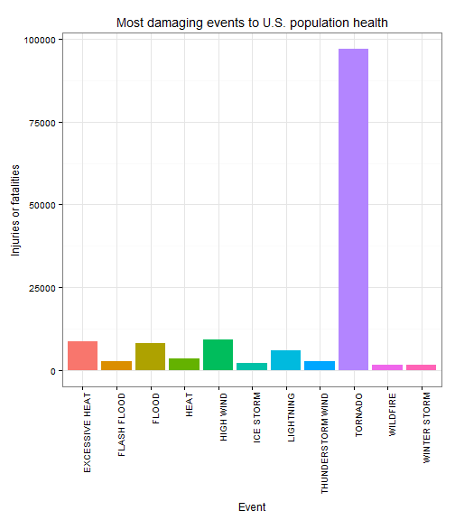
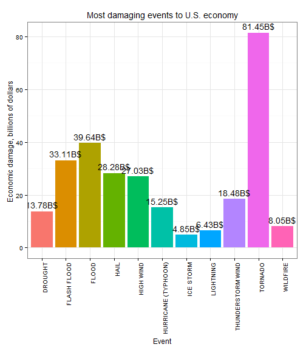

# Synopsis

The purpose of this paper is to provide insight to two questions:

1. Across the United States, which types of events are most harmful with respect
to population health?

2. Across the United States, which types of events have the greatest economic 
consequences?

Intended audience:  government or municipal manager who might be responsible for 
preparing for severe weather events and will need to prioritize resources for 
different types of events.

For analysis, Storm Data provided by National Weather Service was used. All data 
processing information is provided in Data processing section and results are 
covered in Results section.

# Data processing

## Data download and unpacking

This part of code downloads dataset if it does not already exist, extracts it
and saves it into _data_ folder. Output from this part of code is not shown.

Other information about dataset can be found here:

* https://d396qusza40orc.cloudfront.net/repdata%2Fpeer2_doc%2Fpd01016005curr.pdf
* https://d396qusza40orc.cloudfront.net/repdata%2Fpeer2_doc%2FNCDC%20Storm%20Events-FAQ%20Page.pdf


```r
#Load libraries

suppressMessages(library(data.table))
suppressMessages(require(dplyr))
suppressMessages(library(knitr))
suppressMessages(require(R.utils))
suppressMessages(require(stringdist))
suppressMessages(library(ggplot2))
```


```r
Sys.setlocale("LC_TIME", "C");

# Raw data location
dataurl <- "https://d396qusza40orc.cloudfront.net/repdata%2Fdata%2FStormData.csv.bz2"
bzipfile <- "./data/repdata-data-StormData.csv.bz2"
datafile <- "./data/repdata-data-StormData.csv"

# Preparing data
if( !file.exists("./data")) { dir.create("./data") }

if (!file.exists(bzipfile))
  download.file(dataurl,destfile=bzipfile,method="curl")

if (!file.exists(datafile))
  bunzip2(filename=bzipfile, destname=datafile, remove = FALSE)
```

## Reading and cleaning data

Since database consists REMARKS field which contains line breaks within string,
data.table fread cannot be used and read.csv must be used.


```r
# read file

data <- read.csv("data/repdata-data-StormData.csv", stringsAsFactors=F)
data <- as.data.table(data)

# check if we have read all lines. Column "REFNUM" last value should
# match number of read lines

originaldatarows <- nrow(data)

if (nrow(data) != data[nrow(data),]$REFNUM) {
  warning("Number of read lines does not match input data reference numbers!")  
}
```

### Date fields cleaning

Convert storm begin and end date fields.Time fields are not used as they often
contain missing/invalid data


```r
# Storm begin date
data$begindate <- as.Date(data$BGN_DATE, format="%m/%d/%Y")
                   
# Storm end date
data$enddate <- as.Date(data$END_DATE, format="%m/%d/%Y")

# And year
data[, year := year(begindate)]
```

### Propery and crops damage cleanup

As questions indicated are only interested in events which either caused damage
to property or population health then we can exclude such rows which have no 
recorded damage.

While investigating data, it was detected, that lot of nominators that reside
in field _PROPDMGEXP_ and _CROPDMGEXP_, do not conform to specified nominators 
by NOAA. NOAA designates following allowed nominators: 


```r
allowedNominators <- data.table(
    Nominator=c("", "K", "M", "B")    
    , Multiplier=c(1,1000,100000,1000000)
    , Explanation=c(
      "multiplier = 1"
      , "multiplier = 1 000"
      , "multiplier = 100 000"
      , "multiplier = 100 000 000"
      )
  )
kable(allowedNominators, format="markdown", caption = "Allowed nominators", )

allowedNominators[, PROPDMGEXP := Nominator]
allowedNominators[, CROPDMGEXP := Nominator]
```

First, all nominators were upper-cased for both variables  _PROPDMGEXP_ and 
_CROPDMGEXP_:


```r
# Trim function
# http://stackoverflow.com/questions/2261079/how-to-trim-leading-and-trailing-whitespace-in-r
trim <- function (x) gsub("^\\s+|\\s+$", "", x)

data[, PROPDMGEXP:=toupper(trim(PROPDMGEXP))]
data[, CROPDMGEXP:=toupper(trim(CROPDMGEXP))]
```

It can be shown, that only very few events have other than allowed nominator and 
thus events with invalid nominators were left out from analysed data set.


```r
xsum <- data %>% group_by(PROPDMGEXP) %>% 
    summarise(raw.sum=sum(PROPDMG), count=n())

kable(xsum, format="markdown", caption = "Property damage nominators")
```


|PROPDMGEXP |     raw.sum|  count|
|:----------|-----------:|------:|
|K          | 10735292.10| 424665|
|M          |   140733.35|  11337|
|           |      527.41| 465934|
|B          |      275.85|     40|
|+          |      117.00|      5|
|0          |     7108.30|    216|
|5          |      210.50|     28|
|6          |       65.00|      4|
|?          |        0.00|      8|
|4          |       14.50|      4|
|2          |       12.00|     13|
|3          |       20.00|      4|
|H          |       27.00|      7|
|7          |       82.00|      5|
|-          |       15.00|      1|
|1          |        0.00|     25|
|8          |        0.00|      1|

```r
ysum <- data %>% group_by(CROPDMGEXP) %>% 
    summarise(raw.sum=sum(CROPDMG), count=n())

kable(ysum, format="markdown", caption = "Crop damage nominators")
```


|CROPDMGEXP |    raw.sum|  count|
|:----------|----------:|------:|
|           |      11.00| 618413|
|M          |   34150.80|   1995|
|K          | 1343391.91| 281853|
|B          |      13.61|      9|
|?          |       0.00|      7|
|0          |     260.00|     19|
|2          |       0.00|      1|

Now filter data so that we have only events with allowed nominators or damage
to population health left. 


```r
# allow only rows which have population or proprty damage remain
nominators <- as.vector(allowedNominators$Nominator)
x <- data[, FATALITIES > 0 | INJURIES > 0 | 
            ( (PROPDMGEXP %in% nominators) & PROPDMG > 0 ) |   
          ( (CROPDMGEXP %in% nominators) & CROPDMG > 0 )           
          ]

data <- data[x]

# clean propery damage nominator
m <- select(allowedNominators, c(PROPDMGEXP, Multiplier))
setkey(m, PROPDMGEXP)
setkey(data, PROPDMGEXP)
data <- merge(x = data, y = m, all = F)
setnames(data, "Multiplier", "propmultiplier" )

# clean crops damage nominator
m <- select(allowedNominators, c(CROPDMGEXP, Multiplier))
setkey(m, CROPDMGEXP)
setkey(data, CROPDMGEXP)
data <- merge(x = data, y = m, all = F)
setnames(data, "Multiplier", "cropmultiplier" )

removedrows <- ((originaldatarows - (nrow(data))))
print(paste0("As result of nominators cleanup, ",
              removedrows, " rows were removed"))                
```

```
## [1] "As result of nominators cleanup, 647940 rows were removed"
```
---

Resulting dataset is much smaller than original after filtering. **NB!** This 
could cause propblems if we would for example like to estimate likelyhoods of 
certain events in specific states based of all events within that state but as 
this is not focus of this paper, it is ignored for now.

Now we multiple damages with multipliers so we get real scale of damage.


```r
data[, propertydamage := PROPDMG*propmultiplier]
data[, cropdamage := CROPDMG*cropmultiplier]
data[, economicdamage := propertydamage + cropdamage]
```


### Clean up event types

For event types, lot of data is entered. As with damage nominators, these entries
appear to be entering errors.

First we uppercase all event names.

Second, for events which did not match any of official event types described in 
NOAA book, were try them to match as best we could to allowed values:


```r
data[, eventtype := toupper(trim(EVTYPE))]

allowedEvents <- toupper(c(
  "Astronomical Low Tide"
  ,"Avalanche"
  ,"Blizzard"
  ,"Coastal Flood"
  ,"Cold/Wind Chill"
  ,"Debris Flow"
  ,"Dense Fog"
  ,"Dense Smoke"
  ,"Drought"
  ,"Dust Devil"
  ,"Dust Storm"
  ,"Excessive Heat"
  ,"Extreme Cold/Wind Chill"
  ,"Flash Flood"
  ,"Flood"
  ,"Frost/Freeze"
  ,"Funnel Cloud"
  ,"Freezing Fog"
  ,"Hail"
  ,"Heat"
  ,"Heavy Rain"
  ,"Heavy Snow"
  ,"High Surf"
  ,"High Wind"
  ,"Hurricane (Typhoon)"
  ,"Ice Storm"
  ,"Lake-Effect Snow"
  ,"Lakeshore Flood"
  ,"Lightning"
  ,"Marine Hail"
  ,"Marine High Wind"
  ,"Marine Strong Wind"
  ,"Marine Thunderstorm Wind"
  ,"Rip Current"
  ,"Seiche"
  ,"Sleet"
  ,"Storm Surge/Tide"
  ,"Strong Wind"
  ,"Thunderstorm Wind"
  ,"Tornado"
  ,"Tropical Depression"
  ,"Tropical Storm"
  ,"Tsunami"
  ,"Volcanic Ash"
  ,"Waterspout"
  ,"Wildfire"
  ,"Winter Storm"
  ,"Winter Weather"
))
```

---
Function to match events using stringdist package. It does its work somewhat good
but there are some events that were obviously mapped incorrectly. Unfortunately
there was no time to clean events manually. 


```r
# Some data cleaned manually
data[data[, eventtype == "COLD"]]$eventtype <- "COLD/WINDCHILL"
data[data[, eventtype == "COLD WAVE"]]$eventtype <- "COLD/WINDCHILL"
data[data[, eventtype == "EARLY FROST"]]$eventtype <- "FROST/FREEZE"
data[data[, eventtype == "HURRICANE"]]$eventtype <- "HURRICANE (TYPHOON)"
data[data[, eventtype == "HURRICANE OPAL/HIGH WINDS"]]$eventtype <- "HURRICANE (TYPHOON)"
data[data[, eventtype == "HYPERTHERMIA/EXPOSURE"]]$eventtype <- "COLD/WINDCHILL"


matchEvent <- function(x) { 
  dist <- stringdist(allowedEvents,x, method="dl");        
  w <- which(dist[] == min(dist))  
  if (length(w) > 1) {      
     a <- allowedEvents[w]
     dist2 <- stringdist(a,x, method="lcs"); 
     w2 <- which(dist2[] == min(dist2))
     if (length(w2) > 1) {     
        a2 <- a[w2]
        dist3 <- stringdist(a2,x, method="soundex"); 
        w3 <- which(dist3[] == min(dist3))
        a2[min(w3)]
     } else {     
        a[min(w2)]
     }
  } else {     
     allowedEvents[w]
  }
}


events <- unique(data$eventtype)
ev <- as.data.table(events)
setnames(ev, "events", "eventtype")
ev$map.to.noaa.event <- unlist(lapply(events, matchEvent ))
```

Lets add mapped event to main data

```r
setkey(ev, eventtype)
setkey(data, eventtype)
data <- merge(x = data, y = ev, all = F)
```


# Results

Now lets take results together. For simplicity of this analysis, injuries and
fatalities are summed together.

Table shows summary of damage to public health and economy over years.


```r
tidydata <- data %>% group_by(map.to.noaa.event) %>% 
  summarise(healthdamage= (sum(FATALITIES)+sum(INJURIES))
            , economicaldamage=sum(economicdamage)) 

kable(tidydata[order(map.to.noaa.event)], format="markdown")
```


|map.to.noaa.event        | healthdamage| economicaldamage|
|:------------------------|------------:|----------------:|
|ASTRONOMICAL LOW TIDE    |            0|          2095000|
|AVALANCHE                |          395|          2331800|
|BLIZZARD                 |          906|         99496950|
|COASTAL FLOOD            |          127|         98115060|
|COLD/WIND CHILL          |          198|          9744000|
|DENSE FOG                |          361|          8469000|
|DENSE SMOKE              |            0|           100000|
|DROUGHT                  |           68|       1377998600|
|DUST DEVIL               |           45|           741130|
|DUST STORM               |          463|          7399000|
|EXCESSIVE HEAT           |         8723|         67982480|
|EXTREME COLD/WIND CHILL  |          171|          5803000|
|FLASH FLOOD              |         2846|       3311220577|
|FLOOD                    |         8109|       3963615807|
|FREEZING FOG             |           49|          5031500|
|FROST/FREEZE             |            0|        157304000|
|FUNNEL CLOUD             |          398|        152505500|
|HAIL                     |         1510|       2828492280|
|HEAT                     |         3649|          5740450|
|HEAVY RAIN               |          390|        216774440|
|HEAVY SNOW               |         1246|        225157750|
|HIGH SURF                |          408|         15497500|
|HIGH WIND                |         9263|       2702610753|
|HURRICANE (TYPHOON)      |         1462|       1525194810|
|ICE STORM                |         2117|        484917010|
|LAKE-EFFECT SNOW         |            0|         16962000|
|LAKESHORE FLOOD          |            0|           795000|
|LIGHTNING                |         6051|        642996373|
|MARINE HAIL              |          126|         31021800|
|MARINE HIGH WIND         |           21|          3288010|
|MARINE STRONG WIND       |           37|           588330|
|MARINE THUNDERSTORM WIND |           37|          8501400|
|RIP CURRENT              |         1106|           163000|
|SEICHE                   |          143|          9205300|
|SLEET                    |          235|         28505100|
|STORM SURGE/TIDE         |           67|        210412000|
|STRONG WIND              |          450|         84758740|
|THUNDERSTORM WIND        |         2677|       1848310725|
|TORNADO                  |        96969|       8144688193|
|TROPICAL DEPRESSION      |            0|           837000|
|TROPICAL STORM           |          449|        378951550|
|TSUNAMI                  |          162|         15167000|
|VOLCANIC ASH             |            2|           500000|
|WATERSPOUT               |           85|         15777200|
|WILDFIRE                 |         1821|        804735180|
|WINTER STORM             |         1650|        305206750|
|WINTER WEATHER           |          615|         21938000|

## Which event is most damaging to public health across all measured data?

Since to display all items would clatter output, only top 25% is displayed.


```r
topquarter <- filter(tidydata, cume_dist(desc(healthdamage)) < 0.25)
topquarter <- topquarter[order(desc(healthdamage))]

kable(topquarter, format="markdown")
```


|map.to.noaa.event | healthdamage| economicaldamage|
|:-----------------|------------:|----------------:|
|TORNADO           |        96969|       8144688193|
|HIGH WIND         |         9263|       2702610753|
|EXCESSIVE HEAT    |         8723|         67982480|
|FLOOD             |         8109|       3963615807|
|LIGHTNING         |         6051|        642996373|
|HEAT              |         3649|          5740450|
|FLASH FLOOD       |         2846|       3311220577|
|THUNDERSTORM WIND |         2677|       1848310725|
|ICE STORM         |         2117|        484917010|
|WILDFIRE          |         1821|        804735180|
|WINTER STORM      |         1650|        305206750|

```r
plot1 <- qplot(x=map.to.noaa.event                 
                 ,  y=healthdamage, fill=map.to.noaa.event,
                       data=topquarter, geom="bar", stat="identity",
                       position="dodge") + 
#  geom_line( aes(color=City) ) +   
  theme_bw() +
  
  labs(y = expression("Injuries or fatalities")) + 
  labs(x = "Event") +   
  labs(title = 
         expression("Most damaging events to U.S. population health")) +
  theme(axis.text.x = element_text(angle = 90, hjust = 1)
         , legend.position="none")
  
print(plot1)
```

 

## Across the United States, which types of events have the greatest economic consequences?

Since to display all items would clatter output, only top 25% is displayed. 
Results are displayed in billions of dollars.


```r
topquarter <- filter(tidydata, cume_dist(desc(economicaldamage)) < 0.25)
topquarter <- topquarter[order(desc(economicaldamage))]

# Divide result to show reasonable numbers
topquarter[, economicaldamage := (economicaldamage / 100000000)];

kable(topquarter, format="markdown")

plot2 <- qplot(x=map.to.noaa.event                 
                 ,  y=economicaldamage, fill=map.to.noaa.event,
                       data=topquarter, geom="bar", stat="identity",
                       position="dodge") + 
  theme_bw() +
  
  labs(y = expression("Economic damage, billions of dollars")) + 
  labs(x = "Event") +   
   geom_text(aes(label = paste0(as.character(round(economicaldamage, 2)),"B$") )
            , position = position_dodge(width = 0.9)
            , vjust = -0.5, color = "black")+
  labs(title = 
         expression("Most damaging events to U.S. economy")) +
  theme(axis.text.x = element_text(angle = 90, hjust = 1)
         , legend.position="none")
  
print(plot2)
```

```
## ymax not defined: adjusting position using y instead
```

 

As result of this study and taking into account issues of data quality, we can say
that over all, tornadoes have biggest impact on both U.S. population health and
economy. 

Because of available time limits, no attempt was made to investigate matter in 
more details.


# Original research environment

For reproducibility, environment used is reported here


```r
sessionInfo()
```

```
## R version 3.1.2 (2014-10-31)
## Platform: x86_64-w64-mingw32/x64 (64-bit)
## 
## locale:
## [1] LC_COLLATE=Estonian_Estonia.1257  LC_CTYPE=Estonian_Estonia.1257   
## [3] LC_MONETARY=Estonian_Estonia.1257 LC_NUMERIC=C                     
## [5] LC_TIME=C                        
## 
## attached base packages:
## [1] stats     graphics  grDevices utils     datasets  methods   base     
## 
## other attached packages:
## [1] R.utils_1.34.0    R.oo_1.18.0       R.methodsS3_1.7.0 ggplot2_1.0.0    
## [5] stringdist_0.9.0  knitr_1.8         dplyr_0.4.1       data.table_1.9.4 
## 
## loaded via a namespace (and not attached):
##  [1] assertthat_0.1   chron_2.3-45     codetools_0.2-9  colorspace_1.2-4
##  [5] DBI_0.3.1        digest_0.6.8     evaluate_0.5.5   formatR_1.0     
##  [9] grid_3.1.2       gtable_0.1.2     htmltools_0.2.6  labeling_0.3    
## [13] lazyeval_0.1.10  magrittr_1.5     MASS_7.3-35      munsell_0.4.2   
## [17] parallel_3.1.2   plyr_1.8.1       proto_0.3-10     Rcpp_0.11.3     
## [21] reshape2_1.4.1   rmarkdown_0.4.2  scales_0.2.4     stringr_0.6.2   
## [25] tools_3.1.2      yaml_2.1.13
```

# Acknowledgements

All chaps active on those threads:

* https://class.coursera.org/repdata-011/forum/thread?thread_id=39
* https://class.coursera.org/repdata-011/forum/thread?thread_id=53

You saved me huge amount of time.
